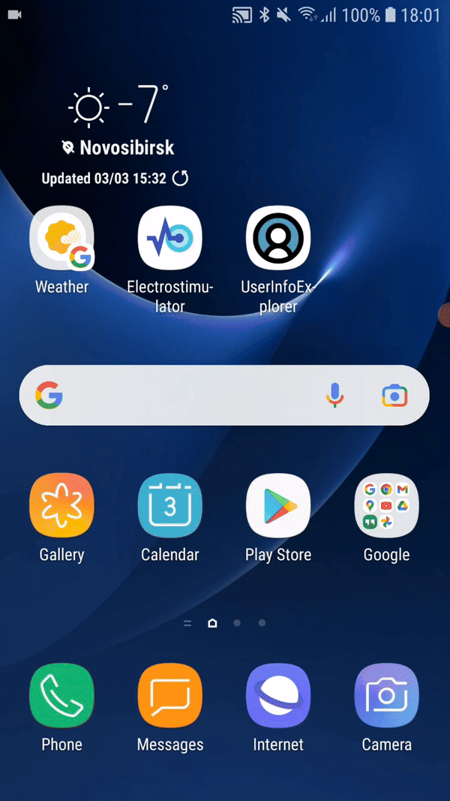

# Electrostimulator
Electrostimulator - это Android-приложение, созданное для взаимодействия с устройством электростимулятора мышц посредством Bluetooth Low Energy (BLE). Пользователи могут легко устанавливать соединение с устройством и редактировать его параметры непосредственно через приложение. Реализовано подтверждения получения новых параметров - после успешного внесения изменений приложение сообщает об этом пользователю. Кроме того, оно надежно обрабатывает все возможные ошибки, связанные с установлением и разрывом связи по Bluetooth.

Дополнительно, в проекте представлен скетч на языке C, расположенный в корневом каталоге, который может быть использован для прошивки микроконтроллера ESP32 для тестирования данного приложения.

## Использованные технологии
* Язык программирования: Kotlin
* Архитектурный паттерн: MVVM (Model-View-ViewModel)
* Встроенные библиотеки для работы с Bluetooth Low Energy
* ViewModel и LiveData для реализации архитектурного паттерна MVVM
* Navigation Component для реализации навигации
* Material Components для дизайна пользовательского интерфейса
* Разметка: XML

## Скриншоты и видео 
  

## Установка: 
1. Клонировать репозиторий.
2. Открыть проект в Android Studio.
3. Собрать и запустить приложение на Android-устройстве.
4. Открыть скетч в среде Arduino и убедиться, что установлены зависимости для ESP32 и BLE.
5. Загрузить прошивку на микроконтроллер ESP32.

После проделывания всех шагов устройство электростимулятора должно отображаться в Android-приложении и быть доступным для подключения. 
